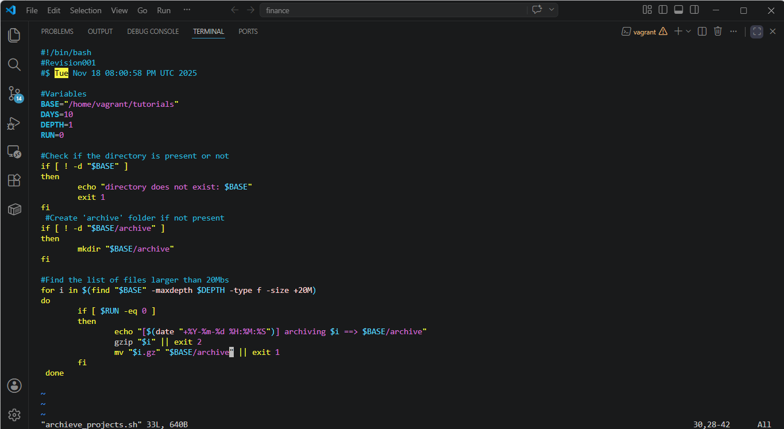
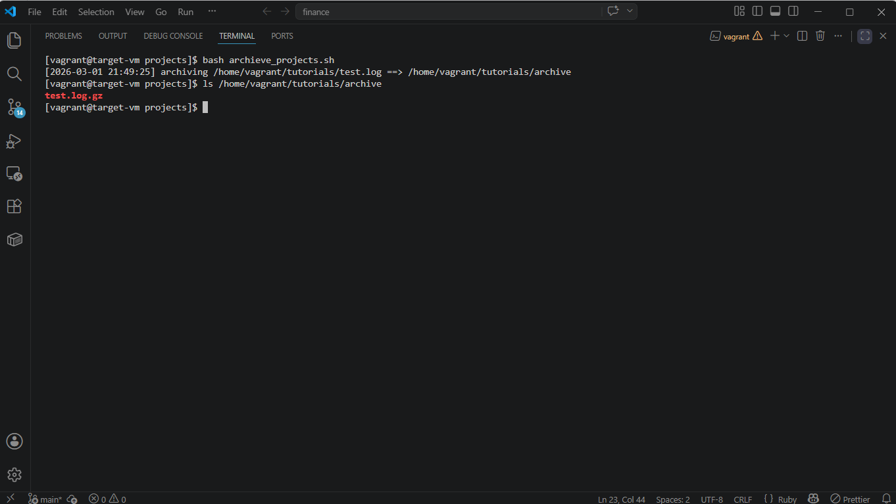

# Linux Log Archive Script

A simple Bash automation script that archives large log files using `gzip` and moves them into an archive directory.

---

## Features

- Checks if target directory exists
- Creates archive folder automatically
- Finds files larger than 20MB
- Compresses files using gzip
- Moves compressed files into archive folder

---

## Technologies Used

- Linux
- Bash Scripting
- gzip
- find command

---

## Project Structure

```text
linux-log-archive-script/
│
├── log_archive.sh
├── README.md
└── screenshots/
    ├── script-code.png
    └── script-output.png
```

---

## Screenshots

### Code Screenshot



### Output Screenshot



---

## How to Run

```bash
chmod +x log_archive.sh
bash log_archive.sh
```

---

## Learning Outcome

Through this project, I practiced:

- Bash scripting basics
- Linux file management
- Automation concepts
- Compression and archiving
- Using loops and conditions in shell scripting